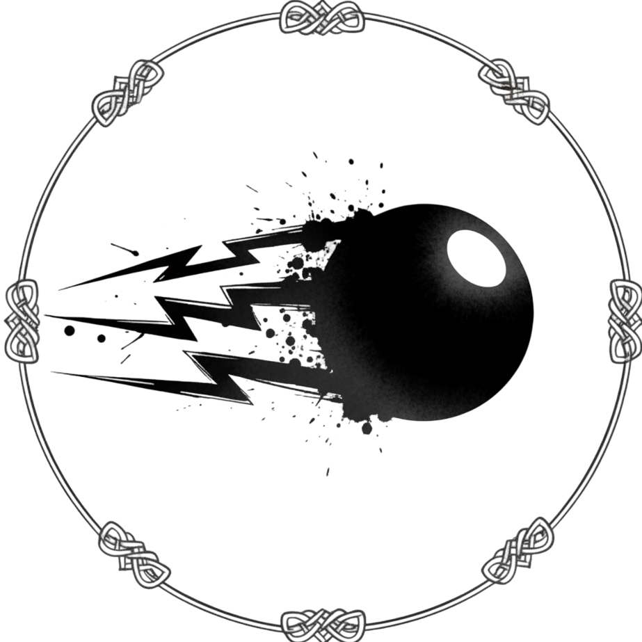

# Arkanoid Game - Object-Oriented Programming Project

## Author
Group [12] - Class [INT 2204]
1. [Nguyễn Quang Vinh] - [MSSV 1]
2. [Đỗ Đức Hưng] - [MSSV 2]
3. [Trần Việt An] - [MSSV 3]
4. [Ngô Quang Dũng] - [MSSV 4]

**Instructor**: [Kiều Văn Tuyên]  
**Semester**: [HK1 - 2025]

---

## Description
This is a classic Arkanoid game developed in Java as a final project for Object-Oriented Programming course. The project demonstrates the implementation of OOP principles and design patterns.

**Key features:**
1. The game is developed using Java 17+ with JavaFX for GUI.
2. Implements core OOP principles: Encapsulation, Inheritance, Polymorphism, and Abstraction.
3. Applies multiple design patterns: Singleton, Factory Method.
4. Features multithreading for smooth gameplay and responsive UI.
5. Includes sound effects, animations, and power-up systems.
6. Supports leaderboard system.

**Game mechanics:**
- Control a paddle to bounce a ball and destroy bricks
- Collect power-ups for special abilities
- Progress through multiple levels with increasing difficulty
- Score points and compete on the leaderboard

---

## UML Diagram

### Class Diagram

---

## Design Patterns Implementation

### 1. Singleton Pattern
**Used in:** `ImageManager`, `SoundManager`

**Purpose:** Ensure only one instance exists throughout the application.

---

## Multithreading Implementation
The game uses multiple threads to ensure smooth performance:

---

## Installation

1. Clone the project from the repository.
2. Open the project in the IDE.
3. Run the project.

## Usage

### Controls
| Key     | Action |
|---------|--------|
| `←`     | Move paddle left |
| `→`     | Move paddle right |
| `SPACE` | Launch ball |
| `1`     | Pause game |

### How to Play
1. **Start the game**: Click "Start" from the main menu.
2. **Control the paddle**: Use arrow keys to move left and right.
3. **Launch the ball**: Press SPACE to launch the ball from the paddle.
4. **Destroy bricks**: Bounce the ball to hit and destroy bricks.
5. **Collect power-ups**: Catch falling power-ups for special abilities.
6. **Avoid losing the ball**: Keep the ball from falling below the paddle.
7. **Complete the level**: Destroy all destructible bricks to advance.

### Power-ups
| Icon | Name | Effect                                      |
|----|------|---------------------------------------------|
|  | PADDLE_EXPAND | Increases paddle width                      |
| | PADDLE_SHRINK | Decreases paddle width                      |
|  | SPEED_UP | Increases ball speed                        |
|  | SPEED_DOWN | Decreases ball speed                        |
|  | MULTI_BALL | Spawns 2 additional balls                   |
|  | LASER_PADDLE | Shoot lasers to destroy bricks for 3 seconds |
|  | MOLTEN_BALL |   |
|  | EXTRA_LIFE |  |

### Scoring System
- +10 points per brick

---

## Demo

### Screenshots

**Main Menu**  

**Gameplay**  

**Power-ups in Action**  

**Leaderboard**  

### Video Demo

---

## Future Improvements

### Planned Features

---

## Technologies Used

| Technology | Version | Purpose |
|------------|---------|---------|
| Java | 17+ | Core language |
| JavaFX | 19.0.2 | GUI framework |
| Maven | 3.9+ | Build tool |

---

## Notes

- The game was developed as part of the Object-Oriented Programming with Java course curriculum.
- All code is written by group members with guidance from the instructor.
- Some assets (images, sounds) may be used for educational purposes under fair use.
- The project demonstrates practical application of OOP concepts and design patterns.

---

*Last updated: [12/11/2025]*